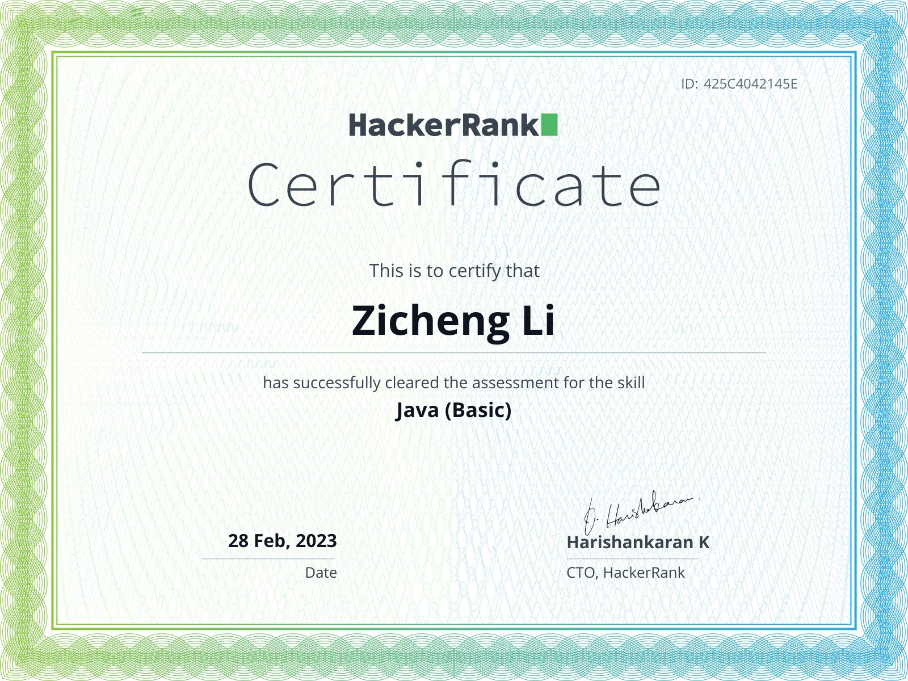

<h2 style="text-align: center;">Welcome to my Github</h2>

I am a Full-Stack Software Developer, and a Comp Sci student
 
I enjoy learning new and exciting technologies, 
 
And I wish to share that same passion with everybody !

## 
<b> Skills</b>

<h3>Programming Languages</h3>

<h3>Backend Development</h3>

<h3>Frontend Development</h3>

<imgsrc="./nextjs.svg" width="50" height="50">

<h3>Data Analysis</h3>

<h3>Other</h3>

<h3 style="text-align: center;" class="title4"> Hackerrank Certificates </h3>

 

<h3 style="text-align: center;" class="title5">Contacts</h3>

